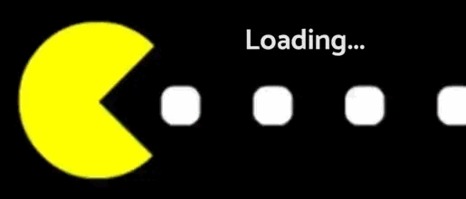

# Individual Project - Videogames App

  

## Objetivos del Proyecto

- Construir una App utlizando React, Redux, NodeJS y PostgreSQL (Sequelize).
- Afirmar y conectar los conceptos aprendidos en la carrera FullStack de Henry.
- Aprender mejores prácticas.
- Aprender y practicar el workflow de GIT.

## Enunciado

La idea general es crear una aplicación en un máximo de dos semanas y media en la cual se puedan ver los distintos videojuegos disponibles junto con información relevante de los mismos utilizando la api externa [rawg](https://rawg.io/apidocs) y a partir de ella poder, entre otras cosas:

  - Buscar videjuegos.
  - Filtrarlos / Ordenarlos.
  - Agregar nuevos videojuegos.
  - Modificar los juegos creados.
  - Borrarlos de la DB.

# Condiciones

El proceso de trabajo cuenta con las siguientes salvedades sobre manejo de la información, a saber:

- Únicos Endpoints/Flags habilitados:
GET https://api.rawg.io/api/games, GET https://api.rawg.io/api/games?search={game}, GET https://api.rawg.io/api/genres, GET https://api.rawg.io/api/games/{id}
- Para las funcionalidades de filtrado y ordenamiento NO pueden utilizarse los endpoints de la API externa, deben realizarse con las herramientas ya disponibles.
- Alguno de los ordenamientos o filtrados debe si o si realizarse desde el frontend.
- No se deberá utilizar librerías externas para aplicar estilos a la app (solo CSS puro, CSS Modules o Styled Components).
